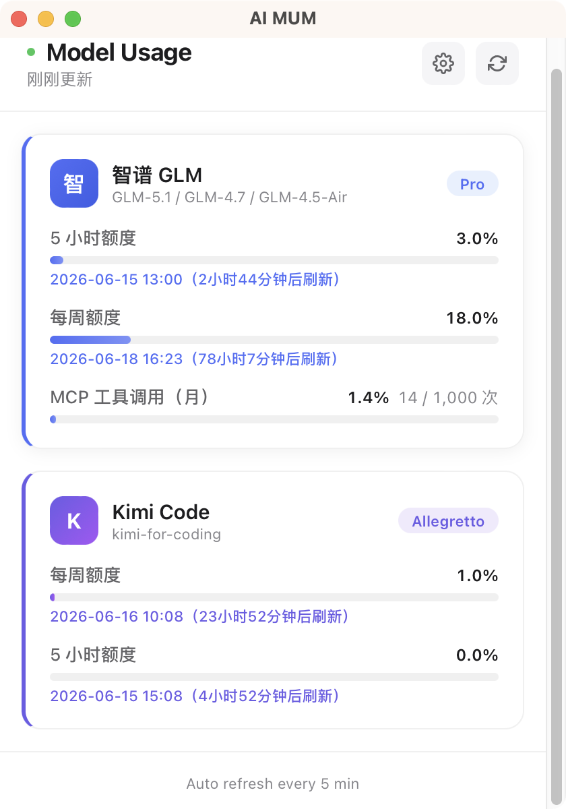

# AI Model Usage Monitor

[](https://github.com/Jieay/ai-model-usage-monitor/actions/workflows/ci.yml)
[](LICENSE)

轻量级 macOS 桌面工具，实时展示大模型编程套餐的用量额度。

> ⚠️ 当前为早期版本，仅支持 macOS。Windows / Linux 适配计划见 [PLAN.md](PLAN.md)。

## 功能

- **智谱 GLM Coding Plan** — 5 小时额度 / 每周额度 / MCP 工具调用额度
- **Kimi Code** — 5 小时额度 / 每周额度
- 卡片式仪表盘，百分比进度条 + 重置倒计时
- 系统托盘常驻，左键切换窗口，右键菜单操作
- 每 5 分钟自动刷新（可配置）
- 深色模式跟随系统
- 资源占用极低（内存 ~30MB，安装包 ~12MB）

## 截图



> 如未生成截图，可运行 `make dev` 后截取主界面替换 `docs/screenshot.png`。

## 下载安装

### 直接下载（推荐）

从 [GitHub Releases](https://github.com/Jieay/ai-model-usage-monitor/releases/latest) 下载最新版 `.dmg` 安装包。

> 仓库链接中的 `Jieay/ai-model-usage-monitor` 需替换为你的实际用户名/仓库名。

### 首次打开提示"无法验证开发者"

因为没有 Apple Developer 签名，用户首次打开时会遇到系统安全提示。解决方法：

1. 右键点击 `.app` 或 `.dmg`，选择「打开」
2. 在弹出的对话框中点击「打开」确认
3. 或在「系统设置 → 隐私与安全性」中点击「仍要打开」

这是所有非 App Store 分发的 macOS 应用的正常行为。

## 技术栈

| 层级 | 技术 |
|---|---|
| 桌面框架 | Tauri v2 |
| 后端 | Rust（reqwest / tokio / chrono） |
| 前端 | Vue 3 + Pinia + TypeScript |
| 构建 | Vite 6 |

## 开发

### 环境要求

- macOS 12+
- [Rust](https://rustup.rs/) 1.80+
- Node.js 18+
- Xcode Command Line Tools（`xcode-select --install`）

### 快捷命令

项目提供了 `Makefile`，所有常用操作均可通过 `make` 命令执行：

```bash
make install-deps    # 安装前后端依赖（首次克隆后执行）
make dev             # 启动开发模式（热重载）
make build           # 构建正式包
make dist            # 构建并显示产物信息
make check           # 检查前后端编译是否通过（不构建）
make open            # 构建并直接打开 .app
make clean           # 清理所有构建产物和依赖
```

### 手动操作

如果不使用 `make`，也可以直接用 npm 命令：

```bash
# 安装前端依赖
npm install

# 启动开发服务器（热重载）
npm run tauri dev

# 构建
npm run tauri build
```

## 打包 Mac 安装包（.dmg）

### 方式一：自动打包（推荐）

```bash
make build
```

Tauri 会自动生成以下产物：

| 产物 | 路径 |
|---|---|
| 可执行文件 | `src-tauri/target/release/ai-usage-monitor` |
| .app 包 | `src-tauri/target/release/bundle/macos/AI Usage Monitor.app` |
| .dmg 安装包 | `src-tauri/target/release/bundle/dmg/AI Usage Monitor_0.1.0_aarch64.dmg` |

如果 `.dmg` 打包报错，通常是缺少 `create-dmg` 工具：

```bash
brew install create-dmg
```

安装后重新执行 `make build` 即可。

### 方式二：手动打包 .dmg

如果自动打包仍有问题，可以手动制作 .dmg：

```bash
# 1. 先构建 .app
make build

# 2. 手动创建 .dmg
create-dmg \
  --volname "AI Usage Monitor" \
  --window-pos 200 120 \
  --window-size 600 400 \
  --icon-size 100 \
  --icon "AI Usage Monitor.app" 150 200 \
  --app-drop-link 450 200 \
  "AI Usage Monitor.dmg" \
  "src-tauri/target/release/bundle/macos/AI Usage Monitor.app"
```

### 方式三：直接分发 .app

不制作 .dmg，直接压缩 `.app` 分发也可以：

```bash
# 构建
make build

# 压缩
cd src-tauri/target/release/bundle/macos
zip -r "../../../../../AI-Usage-Monitor-macOS.zip" "AI Usage Monitor.app"
```

用户下载后解压，拖入 `/Applications` 即可使用。

## 使用

1. 启动应用，点击右上角齿轮图标打开设置
2. 填入 API Key
   - 智谱：在 [open.bigmodel.cn](https://open.bigmodel.cn) 获取
   - Kimi Code：在 [Kimi Code 控制台](https://www.kimi.com/code) 创建 API Key
3. 点击 Save，数据会自动拉取并展示
4. 应用最小化后会收入系统托盘，点击托盘图标可重新打开

## 项目结构

```
oh-my-aimodelusage/
├── src/                        # Vue 3 前端
│   ├── views/Dashboard.vue     # 主面板
│   ├── components/             # 卡片、进度条、设置弹窗
│   ├── stores/usage.ts         # Pinia 状态管理
│   ├── services/tauri.ts       # Tauri 命令调用
│   └── types/usage.ts          # TypeScript 类型
├── src-tauri/                  # Rust 后端
│   ├── src/
│   │   ├── lib.rs              # 入口（托盘、命令注册）
│   │   ├── models.rs           # 数据模型
│   │   ├── vendors/zhipu.rs    # 智谱 API 对接
│   │   ├── vendors/kimi.rs     # Kimi Code API 对接
│   │   ├── scheduler.rs        # 定时刷新
│   │   └── cache.rs            # 本地缓存
│   ├── Cargo.toml
│   └── tauri.conf.json
├── PLAN.md                     # 项目规划文档
├── docs/ui-preview.html        # UI 设计预览
└── LICENSE                     # MIT 许可证
```

## 贡献

欢迎提交 Issue 和 Pull Request。详见 [CONTRIBUTING.md](CONTRIBUTING.md)。

## 许可证

[MIT](LICENSE)

## 致谢

- [Tauri](https://tauri.app/)
- [Vue.js](https://vuejs.org/)
- [智谱 AI](https://open.bigmodel.cn/)
- [Kimi Code](https://www.kimi.com/code)
